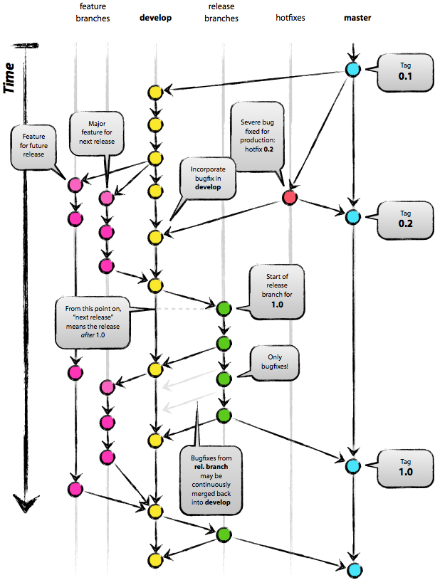

# 클릭하면 회전하는 이미지
## 프로젝트 소개
이미지 클릭시 이미지가 돌아가는 웹사이트

### 사용 기술
HTML, CSS, JS

https://github.com/jsh9611/rotatingImage/assets/57349859/e23e7f9a-244b-421b-8c5d-1ef184de0973

### 담당 역할
- 장성훈 : 프로젝트 초기 설정, 화면에 이미지를 불러오는 기능 구현
- 김은지 : 동적인 이벤트 추가 (rotate 속성)
- 박희범 : 

## 협업 진행 방식
git flow 방식 사용(main, dev, feature)

###  규칙
- Commit: 동사형 영어( Feat, Add) 사용
- Pull Request: 한글로 제목 작성

## 어려웠던 점
- 장성훈 : 잘못된 브랜치에 Push를 하는 문제가 있었다. git status로 체크를 하는 습관을 들여야겠다.
- 김은지 : 자꾸 현재 브랜치가 어디인지 까먹게 된다. 생각보다 역할 나누기가 어렵다.
- 박희범 : Github PR 페이지에서 merge branch 하는 부분이 눈에 잘 안 익는다. 실수하기 쉬운 부분인 거 같다. 

## 출처
- git flow image :[A successful Git branching model](https://nvie.com/posts/a-successful-git-branching-model/)
- Starbucks Korea : https://www.starbucks.co.kr/menu/drink_list.do
